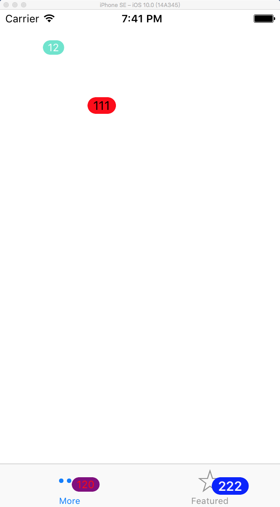

# 介绍
一个简单易用的badgeview，支持自定义背景色，字体，文字颜色。通过扩展UITabbar，任意显示在某个tabbarItem。



#为什么要扩展UITabbar呢
UITabbarItem中其实有设置badgeValue的方法，但是在iOS10后，才能自定义背景色，但是项目中往往会自定义背景色。

@property(nullable, nonatomic, copy) NSString *badgeValue;    // default is nil
@property (nonatomic, readwrite, copy, nullable) UIColor *badgeColor NS_AVAILABLE_IOS(10_0) UI_APPEARANCE_SELECTOR;

#功能点
1. 支持手写frame和autolayout，支持在IB中直接设置bgColor，textColor，badgeValue
2. 自动计算size，手写frame时，只需调用sizetoFit，autolayout设置instrinsicContentSize为placeholder。具体可以看demo。

#实现
###BadgeView
BadgeView的实现比较简单，View里面加个label。

手写frame时，重写了sizeToFit，自适应大小。

```
- (void)sizeToFit {
    [super sizeToFit];

    CGRect frame = self.frame;
    frame.size = [self size];
    self.frame = frame;
}
```

在autolayout下，重写intrinsicContentSize，设置内部size。

```
- (CGSize)intrinsicContentSize {  
    return [self size];
}
```

###UITabbar+Badge
讲下UITabbar+Badge，主要利用category的关联属性，将各个badgeView，以{index:badgeView}放到dict中。主要代码如下：

```
- (NSMutableDictionary *)badgeDict {
    NSMutableDictionary *dict = objc_getAssociatedObject(self, _cmd);
    if (!dict) {
        dict = [NSMutableDictionary dictionaryWithCapacity:0];
        objc_setAssociatedObject(self, _cmd, dict, OBJC_ASSOCIATION_RETAIN);
    }
    
    return dict;
}

- (BadgeView *)badgeViewAtIndex:(NSInteger)index {
    BadgeView *badgeView =  [self.badgeDict objectForKey:@(index)];
    if (!badgeView && self.items.count > 0) {
        badgeView = [[BadgeView alloc] init];
        
        [badgeView sizeToFit];
        
        float tabItemWidth = self.bounds.size.width / self.items.count;
        
        CGRect frame = badgeView.frame;
        frame.origin = CGPointMake(tabItemWidth * index + tabItemWidth / 2 + 2, 15);
        badgeView.frame = frame;
        
        [self addSubview:badgeView];
        
        [self.badgeDict setObject:badgeView forKey:@(index)];
    }
    
    return badgeView;
}
```

暴露了几个基础方法，有需要可自行添加。

```
@interface UITabBar (Badge)

// 更新badge和bgColor
- (void)updateBadge:(NSString *)badge bgColor:(UIColor *)bgColor atIndex:(NSInteger)index;

// 更新badge
- (void)updateBadge:(NSString *)badge atIndex:(NSInteger)index;

// 更新文本颜色
- (void)updateBadgeTextColor:(UIColor *)textColor atIndex:(NSInteger)index;

// 更新背景色
- (void)updateBadgeBgColor:(UIColor *)bgColor atIndex:(NSInteger)index;

// 更新文本字体
- (void)updateBadgeTextFont:(UIFont *)textFont atIndex:(NSInteger)index;

@end
```

#使用
直接将BadgeView.h/m，UITabbar+Badge.h/m拖动工程中。

1.手写frame
只需设置origin。

```
BadgeView *badgeView = [[BadgeView alloc] initWithFrame:CGRectMake(100, 100, 0, 0)];

badgeView.badgeValue = @"111";
badgeView.textColor = [UIColor blackColor];
badgeView.textFont = [UIFont systemFontOfSize:14];
badgeView.bgColor = [UIColor redColor];
[badgeView sizeToFit];

[self.view addSubview:badgeView];
```

2.tabbar添加badge
在tabbarController里面，这里测试放在了viewDidLoad里面。

```
- (void)viewDidLoad {
    [super viewDidLoad];
    // Do any additional setup after loading the view.
    
    [self.tabBar updateBadge:@"120" bgColor:[UIColor purpleColor] atIndex:0];
    [self.tabBar updateBadgeTextColor:[UIColor redColor] atIndex:0];

    [self.tabBar updateBadge:@"222" bgColor:[UIColor blueColor] atIndex:1];
    [self.tabBar updateBadgeTextFont:[UIFont boldSystemFontOfSize:15] atIndex:1];
}
```